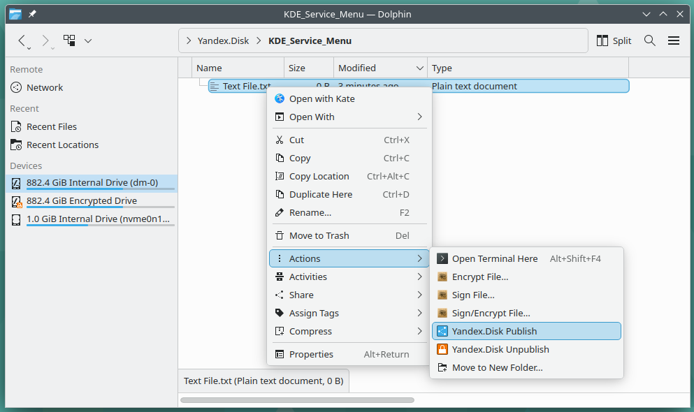
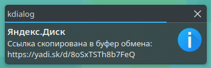

# Yandex.Disk KDE Service Menu

Service menu для KDE 5/6, который позволяет получить быстрый доступ к сервису Яндекс.Диск

---






---

## Возможности

- Опубликовать файл/каталог и скопировать публичную ссылку буфер обмена
- Снять с публикации файл/каталог

При публикации файла/каталога вне директории диска, объект будет скопирован в корень диска и опубликован, это стандартное поведение самой утилиты yandex-disk.

```sh
publish    make file/folder public, output public link to STDOUT.
            Object will be copied to the root of sync folder.
            To overwrite existing objects use
            the option --overwrite.
```

## Зависимости

- **KDE 5/6**
- Консольный клиент для Linux - http://help.yandex.ru/disk/cli-clients.xml  
    - **ALT Linux** - https://www.altlinux.org/Яндекс_Диск
    - **Arch Linux** - https://aur.archlinux.org/packages/yandex-disk/

- `libnotify`
- `kdialog`
- `xsel`

## Установка

### ALT Linux

- В России [altlinux.space/jidckii/-/packages/alt](https://altlinux.space/jidckii/-/packages/alt/yandex-disk-kde-service-menu/)
- Не в России [codeberg.org/jidckii/-/packages/alt](https://codeberg.org/jidckii/-/packages/alt/yandex-disk-kde-service-menu/)

### Debian/Ubuntu

- В России [altlinux.space/jidckii/-/packages/debian](https://altlinux.space/jidckii/-/packages/debian/yandex-disk-kde-service-menu/)
- Не в России [codeberg.org/jidckii/-/packages/debian](https://codeberg.org/jidckii/-/packages/debian/yandex-disk-kde-service-menu/)

### RHEL/SUSE

- В России [altlinux.space/jidckii/-/packages/rpm](https://altlinux.space/jidckii/-/packages/rpm/yandex-disk-kde-service-menu/)
- Не в России [codeberg.org/jidckii/-/packages/rpm](https://codeberg.org/jidckii/-/packages/rpm/yandex-disk-kde-service-menu/)

### Arch Linux

- В России [altlinux.space/jidckii/-/packages/arch](https://altlinux.space/jidckii/-/packages/arch/yandex-disk-kde-service-menu/)
- Не в России [codeberg.org/jidckii/-/packages/arch](https://codeberg.org/jidckii/-/packages/arch/yandex-disk-kde-service-menu/)

### Вручную


## Ссылки и благодарности

- При поддержке [tuna.am](https://tuna.am)
- Оригинальный но устаревший проект для KDE 4 <https://github.com/kors2m/YandexDisk_SM>
